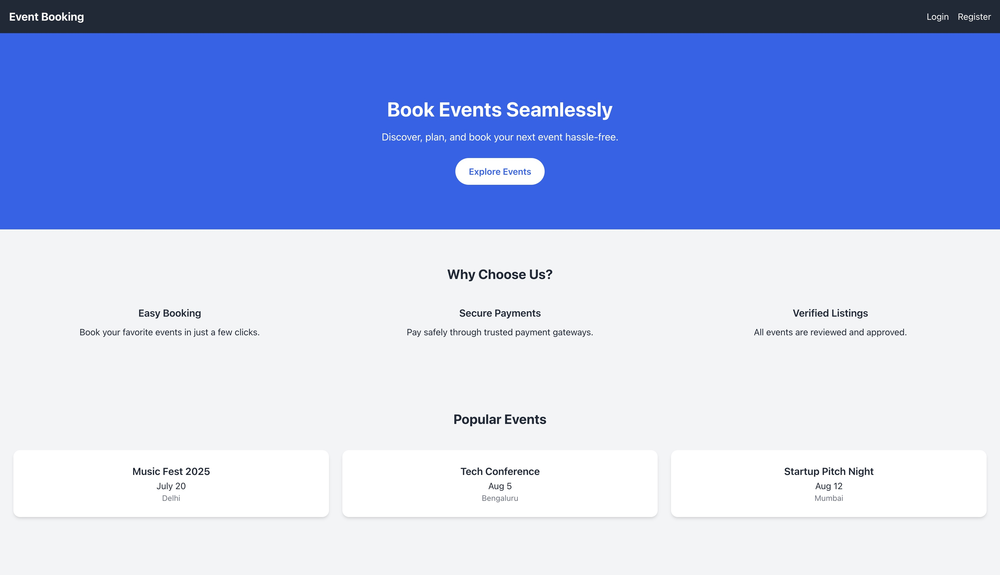

# 🎟️ Event Booking System

**Event Booking System** is a full-stack web application that allows users to browse, book, and manage event reservations. Built using the **MERN stack** with **MySQL** as the database, the platform provides secure login functionality and real-time seat availability.

### 🔐 Hero Page

---

## 🚀 Features

- User **signup** and **login** with JWT authentication  
- View a list of upcoming **events** with event details (name, location, date, total seats, available seats)  
- **Book** events based on the number of seats available  
- Realtime update of **available seats** after successful booking  
- Displays **confirmation message** upon successful booking  

**Alerts if:**

- User is not logged in  
- Number of seats requested exceeds availability  

- Simple and intuitive frontend using **React.js**  
- Backend API built with **Node.js** and **Express.js**  
- Relational data handling with **MySQL**  

---

## 🛠️ Tech Stack

- **Frontend**: React.js, HTML, CSS, JavaScript  
- **Backend**: Node.js, Express.js  
- **Database**: MySQL (via Sequelize / mysql2)  
- **Authentication**: JWT-based  

**Hosting**:  
- **Frontend**: Netlify  
- **Backend**: (e.g., Render / Railway / Vercel API – mention if hosted)  

---

## 📍 How It Works

1. User signs up / logs in  
2. Fetches list of all upcoming events  
3. Each event shows number of seats left  
4. On booking:  
   - Available seats are updated  
   - Booking is saved with event ID and user details  
5. Backend validates:  
   - Login status  
   - Seat availability  

---

## 🖥️ Live Demo

👉 **[Click Here to Explore the App](https://event-bookin.netlify.app/)**

---
