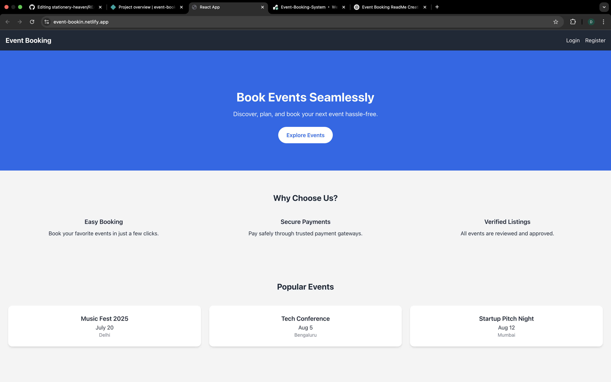

### 🔐 Hero Page

---
---

# 🎫 Event Booking Platform

A modern and responsive Event Booking web application that allows users to browse, explore, and book events seamlessly.

🌐 **Live at**: [https://event-bookin.netlify.app/](https://event-bookin.netlify.app/)

---

## ✨ Overview

The Event Booking Platform is a front-end application built to simulate a real-world event booking system. With a sleek and modern interface, users can explore upcoming events and book their spots easily.

 <!-- Replace with actual image if available -->

---

## 🚀 Features

- 🏠 Beautiful Landing Page with smooth animations
- 🔍 Browse available events
- 📆 Book an event in just a few clicks
- 🎨 Responsive design across devices
- 💡 Clean UI/UX for seamless navigation

---

## 🛠️ Tech Stack

- **Frontend**: HTML, CSS, JavaScript
- **Styling**: Tailwind CSS (optional, if used)
- **Animation**: AOS (Animate on Scroll) Library
- **Hosting**: Netlify

---

## 📂 Folder Structure

```bash
event-booking/
